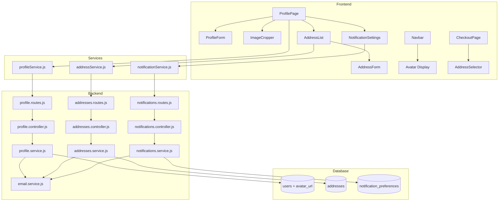

# Design Document: Customer Profile Page

## Overview

Fitur Customer Profile Page menambahkan halaman `/profile` yang memungkinkan pelanggan Gala Printing mengelola informasi pribadi, daftar alamat pengiriman, dan preferensi notifikasi email. Fitur ini juga mengintegrasikan avatar ke Navbar, menyediakan Address Selector di halaman Checkout, dan mengirim email transaksional via Resend ketika status pesanan berubah sesuai preferensi pelanggan.

Fitur ini dibangun di atas stack yang sudah ada: React + Vite (frontend), Express.js (backend), PostgreSQL/MySQL (database), JWT auth, dan multer untuk file upload.

### Keputusan Desain Utama

- **Avatar disimpan di disk lokal** (`uploads/avatars/`) mengikuti pola yang sudah ada untuk `uploads/designs/`, `uploads/payments/`, dan `uploads/chat/`. StorageService yang ada diperluas dengan subdirektori `avatars`.
- **Crop dilakukan di sisi klien** menggunakan library `react-easy-crop` sebelum upload, sehingga server hanya menerima gambar yang sudah di-crop (tidak perlu pemrosesan gambar di server).
- **Notifikasi email dikirim secara asinkron** (fire-and-forget) dari `orders.service.js` saat status berubah, sehingga kegagalan email tidak memblokir respons API.
- **Preferensi notifikasi** disimpan dalam tabel terpisah `notification_preferences` (one-to-one dengan users) untuk memudahkan query dan ekstensi di masa depan.
- **Alamat** disimpan dalam tabel `addresses` yang terpisah dari tabel `orders`, sehingga perubahan alamat tidak mempengaruhi data historis pesanan.
- **AuthContext diperluas** dengan `avatar_url` agar Navbar dapat menampilkan foto profil terbaru tanpa page refresh.

---

## Architecture



### Alur Data Utama

1. **Profile Update**: `ProfileForm` → `profileService.updateProfile()` → `PUT /api/profile` → `profile.service.updateProfile()` → UPDATE users → return updated user → `AuthContext.updateUser()`
2. **Avatar Upload**: `ImageCropper` (crop di klien) → `profileService.uploadAvatar()` → `POST /api/profile/avatar` (multipart) → `StorageService.save('avatars')` → UPDATE users.avatar_url → return new URL → `AuthContext.updateUser()`
3. **Address CRUD**: `AddressForm` → `addressService.*()` → `/api/addresses/*` → `addresses.service.*()` → addresses table
4. **Notification Preferences**: `NotificationSettings` → `notificationService.update()` → `PUT /api/profile/notifications` → `notifications.service.update()` → notification_preferences table
5. **Email on Status Change**: `orders.service.updateOrderStatus()` → `email.service.sendOrderNotification()` → Resend API (fire-and-forget)

---

## Components and Interfaces

### Backend Routes

```
GET    /api/profile                    — ambil profil Customer yang sedang login
PUT    /api/profile                    — update biodata (name, phone, dob, gender)
POST   /api/profile/avatar             — upload foto profil (multipart/form-data)
GET    /api/profile/notifications      — ambil preferensi notifikasi
PUT    /api/profile/notifications      — update preferensi notifikasi

GET    /api/addresses                  — daftar alamat milik Customer
POST   /api/addresses                  — tambah alamat baru
PUT    /api/addresses/:id              — edit alamat
DELETE /api/addresses/:id              — hapus alamat
```

Semua endpoint di atas dilindungi oleh middleware `authenticate`. Endpoint `/api/addresses/:id` juga memvalidasi kepemilikan (address.user_id === req.user.id).

### Frontend Services

**`src/services/profileService.js`**
```js
getProfile()                          // GET /api/profile
updateProfile(data)                   // PUT /api/profile
uploadAvatar(formData)                // POST /api/profile/avatar
getNotificationPreferences()          // GET /api/profile/notifications
updateNotificationPreferences(prefs)  // PUT /api/profile/notifications
```

**`src/services/addressService.js`**
```js
getAddresses()                        // GET /api/addresses
createAddress(data)                   // POST /api/addresses
updateAddress(id, data)               // PUT /api/addresses/:id
deleteAddress(id)                     // DELETE /api/addresses/:id
```

### Frontend Components

| Komponen | Path | Deskripsi |
|---|---|---|
| `ProfilePage` | `src/components/pages/public/ProfilePage.jsx` | Halaman utama `/profile`, mengorkestrasi semua sub-komponen |
| `ProfileForm` | `src/components/profile/ProfileForm.jsx` | Form biodata diri dengan mode view/edit |
| `ImageCropper` | `src/components/profile/ImageCropper.jsx` | Modal crop foto profil menggunakan `react-easy-crop` |
| `AddressList` | `src/components/profile/AddressList.jsx` | Daftar alamat tersimpan dengan tombol edit/hapus |
| `AddressForm` | `src/components/profile/AddressForm.jsx` | Modal form tambah/edit alamat |
| `NotificationSettings` | `src/components/profile/NotificationSettings.jsx` | Panel checkbox preferensi notifikasi email |
| `AddressSelector` | `src/components/shared/AddressSelector.jsx` | Dropdown/modal pemilihan alamat di CheckoutPage |

### AuthContext Extension

`AuthContext` diperluas untuk menyimpan `avatar_url` sebagai bagian dari objek `user`. Fungsi `updateUser` yang sudah ada digunakan untuk memperbarui avatar setelah upload berhasil. Backend endpoint `GET /api/auth/me` juga diperbarui untuk menyertakan `avatar_url` dalam respons.

---

## Data Models

### Migration 023: Add avatar_url to users

```sql
-- server/src/db/migrations/023_add_avatar_url_to_users.sql
ALTER TABLE users
  ADD COLUMN IF NOT EXISTS avatar_url VARCHAR(500) DEFAULT NULL;
```

### Migration 024: Create addresses table

```sql
-- server/src/db/migrations/024_create_addresses.sql
CREATE TABLE IF NOT EXISTS addresses (
  id           CHAR(36)     NOT NULL PRIMARY KEY,
  user_id      CHAR(36)     NOT NULL,
  title        VARCHAR(100) NOT NULL,
  name         VARCHAR(120) NOT NULL,
  phone        VARCHAR(30)  NOT NULL,
  full_address TEXT         NOT NULL,
  created_at   DATETIME     NOT NULL DEFAULT CURRENT_TIMESTAMP,
  updated_at   DATETIME     NOT NULL DEFAULT CURRENT_TIMESTAMP ON UPDATE CURRENT_TIMESTAMP,
  CONSTRAINT fk_address_user FOREIGN KEY (user_id)
    REFERENCES users(id) ON DELETE CASCADE
) ENGINE=InnoDB DEFAULT CHARSET=utf8mb4;

CREATE INDEX idx_addresses_user_id ON addresses(user_id);
```

### Migration 025: Create notification_preferences table

```sql
-- server/src/db/migrations/025_create_notification_preferences.sql
CREATE TABLE IF NOT EXISTS notification_preferences (
  user_id              CHAR(36) NOT NULL PRIMARY KEY,
  payment_accepted     TINYINT(1) NOT NULL DEFAULT 1,
  order_shipped        TINYINT(1) NOT NULL DEFAULT 1,
  order_finished       TINYINT(1) NOT NULL DEFAULT 1,
  order_cancelled      TINYINT(1) NOT NULL DEFAULT 1,
  promo_news           TINYINT(1) NOT NULL DEFAULT 0,
  updated_at           DATETIME NOT NULL DEFAULT CURRENT_TIMESTAMP ON UPDATE CURRENT_TIMESTAMP,
  CONSTRAINT fk_notif_pref_user FOREIGN KEY (user_id)
    REFERENCES users(id) ON DELETE CASCADE
) ENGINE=InnoDB DEFAULT CHARSET=utf8mb4;
```

### Address Object Shape

```js
{
  id: "uuid",
  user_id: "uuid",
  title: "Rumah",           // e.g. "Rumah", "Kantor"
  name: "Budi Santoso",
  phone: "081234567890",
  full_address: "Jl. Merdeka No. 1, Jakarta Pusat 10110",
  created_at: "2024-01-01T00:00:00.000Z",
  updated_at: "2024-01-01T00:00:00.000Z"
}
```

### Notification Preferences Object Shape

```js
{
  payment_accepted: true,
  order_shipped: true,
  order_finished: true,
  order_cancelled: true,
  promo_news: false
}
```

### Email Notification Mapping

| Status Pesanan | Kolom Preferensi | Template Email |
|---|---|---|
| `Payment Accepted` | `payment_accepted` | `payment-accepted` |
| `In Delivery` | `order_shipped` | `order-shipped` |
| `Finished` | `order_finished` | `order-finished` |
| `Cancelled` | `order_cancelled` | `order-cancelled` |
| (promo baru) | `promo_news` | `promo-announcement` |

---

## Correctness Properties

*A property is a characteristic or behavior that should hold true across all valid executions of a system — essentially, a formal statement about what the system should do. Properties serve as the bridge between human-readable specifications and machine-verifiable correctness guarantees.*

### Property 1: Non-customer role redirect

*For any* user role that is not `customer` (e.g., `admin`, `owner`, `cashier`, `cs`, `operational`, `qc`, `offline`), rendering ProfilePage with that role should result in a redirect to `/register`.

**Validates: Requirements 1.3**

---

### Property 2: Profile update round-trip

*For any* valid profile update payload (name: non-empty string, phone: 8–15 digit numeric string, dob: valid date or null, gender: 'L'|'P'|null), calling the update profile service and then fetching the profile should return data that matches the submitted payload.

**Validates: Requirements 2.3**

---

### Property 3: Phone validation rejects invalid inputs

*For any* string that is not composed of 8–15 numeric digits (e.g., contains letters, special characters, or is too short/long), the ProfileForm phone validation should reject it and not submit the request.

**Validates: Requirements 2.5**

---

### Property 4: Non-image MIME type rejection

*For any* MIME type string that is not one of `image/jpeg`, `image/png`, `image/webp`, `image/gif`, the avatar upload endpoint should return HTTP 415 and the ImageCropper should display the format error message.

**Validates: Requirements 3.4, 9.4**

---

### Property 5: Avatar upload persists URL

*For any* valid image file uploaded as an avatar, the API should store the file in `uploads/avatars/` and update the user's `avatar_url` in the database such that fetching the profile returns the new URL.

**Validates: Requirements 3.6**

---

### Property 6: Address list renders all saved addresses

*For any* list of 1–10 saved addresses belonging to a customer, the AddressList component should render exactly that many address entries in the DOM.

**Validates: Requirements 5.1**

---

### Property 7: Address creation round-trip

*For any* valid address payload (title, name, phone, full_address all non-empty), calling createAddress and then getAddresses should return a list that contains an entry matching the submitted data.

**Validates: Requirements 5.3**

---

### Property 8: Address deletion removes entry

*For any* address that exists in the database, calling deleteAddress with its ID and then getAddresses should return a list that does not contain that address.

**Validates: Requirements 5.11**

---

### Property 9: Address selector populates form fields

*For any* saved address, selecting it in the AddressSelector should populate the checkout form's name, phone, and address fields with values that exactly match the address data.

**Validates: Requirements 6.2**

---

### Property 10: Notification preferences round-trip

*For any* combination of boolean values for the five notification preference fields, calling updateNotificationPreferences and then getNotificationPreferences should return the exact same combination of values.

**Validates: Requirements 7.2, 7.4**

---

### Property 11: Email sent if and only if preference is enabled

*For any* order status transition that maps to a notification type, and *for any* customer notification preference state, the email service should be called if and only if the customer has that notification type enabled.

**Validates: Requirements 8.1, 8.2, 8.3, 8.4**

---

### Property 12: Unauthenticated requests return 401

*For any* profile, address, or notification preferences endpoint, sending a request without a valid Bearer token should return HTTP 401.

**Validates: Requirements 9.1**

---

### Property 13: Cross-customer access returns 403

*For any* two distinct customer IDs A and B, attempting to read or modify customer A's addresses or profile using customer B's authentication token should return HTTP 403.

**Validates: Requirements 9.2, 9.3**

---

## Error Handling

### Frontend

| Skenario | Penanganan |
|---|---|
| Gagal memuat profil | Tampilkan pesan error inline, tombol retry |
| Gagal menyimpan profil | Tampilkan toast error dengan pesan dari server |
| File avatar bukan gambar | Tampilkan error di ImageCropper sebelum upload |
| File avatar > 5 MB | Tampilkan error di ImageCropper sebelum upload |
| Gagal upload avatar | Tampilkan toast error |
| Gagal memuat alamat | Tampilkan pesan error di AddressList |
| Gagal menyimpan alamat | Tampilkan error di AddressForm |
| Batas 10 alamat tercapai | Nonaktifkan tombol "Tambah Alamat", tampilkan pesan |
| Sesi kedaluwarsa | Interceptor httpClient sudah menangani redirect ke /register |

### Backend

| Skenario | HTTP Status | Respons |
|---|---|---|
| Token tidak ada/tidak valid | 401 | `{ ok: false, message: "Token tidak valid atau sudah kedaluwarsa." }` |
| Akses data milik user lain | 403 | `{ ok: false, message: "Akses ditolak." }` |
| Tipe MIME file tidak valid | 415 | `{ ok: false, message: "Tipe file tidak didukung." }` |
| Ukuran file melebihi batas | 413 | `{ ok: false, message: "Ukuran file melebihi batas." }` |
| Validasi input gagal | 422 | `{ ok: false, message: "Validasi gagal.", errors: {...} }` |
| Batas 10 alamat tercapai | 422 | `{ ok: false, message: "Batas maksimal 10 alamat telah tercapai." }` |
| Alamat tidak ditemukan | 404 | `{ ok: false, message: "Alamat tidak ditemukan." }` |
| Kegagalan pengiriman email | — | Log error ke console, tidak melempar exception (fire-and-forget) |

### Email Service Error Isolation

`email.service.js` membungkus semua panggilan Resend dalam try-catch. Kegagalan email dicatat ke `console.error` dan tidak melempar exception ke pemanggil, sehingga alur utama (update status pesanan) tidak terganggu.

```js
// Contoh pola fire-and-forget
async function sendOrderNotification(order, notifType) {
  try {
    await resend.emails.send({ ... });
  } catch (err) {
    console.error('[email] Failed to send notification:', err.message);
    // Tidak re-throw — kegagalan email tidak boleh memblokir respons API
  }
}
```

---

## Testing Strategy

### Unit Tests (Vitest)

**Backend:**
- `profile.service.js`: test `updateProfile` dengan data valid, test validasi nama kosong, test validasi phone
- `addresses.service.js`: test `createAddress`, `updateAddress`, `deleteAddress`, `listAddresses` dengan mock DB
- `notifications.service.js`: test `getPreferences` (default values untuk user baru), test `updatePreferences`
- `email.service.js`: test bahwa kegagalan Resend tidak melempar exception, test mapping status → template

**Frontend:**
- `ProfileForm`: test mode view/edit toggle, test validasi nama kosong, test validasi phone
- `ImageCropper`: test penolakan MIME type tidak valid, test penolakan file > 5 MB
- `AddressForm`: test validasi semua field wajib
- `NotificationSettings`: test render checkbox sesuai preferensi
- `AddressSelector`: test pengisian form setelah pemilihan alamat

### Property-Based Tests (Vitest + fast-check)

Library: **fast-check** (sudah tersedia di `devDependencies` di kedua `package.json`)

Setiap property test dikonfigurasi dengan minimum **100 iterasi**.

Tag format: `// Feature: customer-profile-page, Property N: <property_text>`

**Property 1** — Non-customer role redirect:
```js
// Feature: customer-profile-page, Property 1: non-customer role redirect
fc.assert(fc.property(
  fc.constantFrom('admin', 'owner', 'cashier', 'cs', 'operational', 'qc', 'offline'),
  (role) => { /* render ProfilePage with role, assert redirect */ }
), { numRuns: 100 });
```

**Property 2** — Profile update round-trip:
```js
// Feature: customer-profile-page, Property 2: profile update round-trip
fc.assert(fc.property(
  fc.record({
    name: fc.string({ minLength: 1, maxLength: 120 }),
    phone: fc.stringMatching(/^[0-9]{8,15}$/),
    dob: fc.option(fc.date()),
    gender: fc.option(fc.constantFrom('L', 'P')),
  }),
  async (profileData) => { /* call updateProfile, fetch, assert match */ }
), { numRuns: 100 });
```

**Property 3** — Phone validation rejects invalid inputs:
```js
// Feature: customer-profile-page, Property 3: phone validation rejects invalid inputs
fc.assert(fc.property(
  fc.oneof(
    fc.string().filter(s => !/^[0-9]{8,15}$/.test(s)),
    fc.string({ maxLength: 7 }),
    fc.string({ minLength: 16 }),
  ),
  (invalidPhone) => { /* assert validation returns error */ }
), { numRuns: 100 });
```

**Property 4** — Non-image MIME type rejection:
```js
// Feature: customer-profile-page, Property 4: non-image MIME type rejection
const ALLOWED = ['image/jpeg', 'image/png', 'image/webp', 'image/gif'];
fc.assert(fc.property(
  fc.string().filter(s => !ALLOWED.includes(s)),
  (mimeType) => { /* assert upload returns 415 */ }
), { numRuns: 100 });
```

**Property 5** — Avatar upload persists URL:
```js
// Feature: customer-profile-page, Property 5: avatar upload persists URL
fc.assert(fc.property(
  fc.uint8Array({ minLength: 100, maxLength: 10000 }),
  async (imageBytes) => { /* upload, fetch profile, assert avatar_url is set */ }
), { numRuns: 100 });
```

**Property 6** — Address list renders all saved addresses:
```js
// Feature: customer-profile-page, Property 6: address list renders all saved addresses
fc.assert(fc.property(
  fc.array(addressArbitrary, { minLength: 1, maxLength: 10 }),
  (addresses) => { /* render AddressList, assert all addresses appear */ }
), { numRuns: 100 });
```

**Property 7** — Address creation round-trip:
```js
// Feature: customer-profile-page, Property 7: address creation round-trip
fc.assert(fc.property(
  fc.record({
    title: fc.string({ minLength: 1, maxLength: 100 }),
    name: fc.string({ minLength: 1, maxLength: 120 }),
    phone: fc.stringMatching(/^[0-9]{8,15}$/),
    full_address: fc.string({ minLength: 1 }),
  }),
  async (addressData) => { /* create, list, assert contains */ }
), { numRuns: 100 });
```

**Property 8** — Address deletion removes entry:
```js
// Feature: customer-profile-page, Property 8: address deletion removes entry
fc.assert(fc.property(
  addressArbitrary,
  async (address) => { /* create, delete, list, assert not contains */ }
), { numRuns: 100 });
```

**Property 9** — Address selector populates form fields:
```js
// Feature: customer-profile-page, Property 9: address selector populates form fields
fc.assert(fc.property(
  addressArbitrary,
  (address) => { /* render AddressSelector, select address, assert form fields match */ }
), { numRuns: 100 });
```

**Property 10** — Notification preferences round-trip:
```js
// Feature: customer-profile-page, Property 10: notification preferences round-trip
fc.assert(fc.property(
  fc.record({
    payment_accepted: fc.boolean(),
    order_shipped: fc.boolean(),
    order_finished: fc.boolean(),
    order_cancelled: fc.boolean(),
    promo_news: fc.boolean(),
  }),
  async (prefs) => { /* update, fetch, assert match */ }
), { numRuns: 100 });
```

**Property 11** — Email sent if and only if preference is enabled:
```js
// Feature: customer-profile-page, Property 11: email sent iff preference enabled
fc.assert(fc.property(
  fc.constantFrom('Payment Accepted', 'In Delivery', 'Finished', 'Cancelled'),
  fc.record({
    payment_accepted: fc.boolean(),
    order_shipped: fc.boolean(),
    order_finished: fc.boolean(),
    order_cancelled: fc.boolean(),
  }),
  (newStatus, prefs) => {
    /* mock Resend, trigger status change, assert email called iff pref enabled */
  }
), { numRuns: 100 });
```

**Property 12** — Unauthenticated requests return 401:
```js
// Feature: customer-profile-page, Property 12: unauthenticated requests return 401
fc.assert(fc.property(
  fc.constantFrom(
    'GET /api/profile',
    'PUT /api/profile',
    'POST /api/profile/avatar',
    'GET /api/profile/notifications',
    'PUT /api/profile/notifications',
    'GET /api/addresses',
    'POST /api/addresses',
    'PUT /api/addresses/some-id',
    'DELETE /api/addresses/some-id',
  ),
  async (endpoint) => { /* call without token, assert 401 */ }
), { numRuns: 100 });
```

**Property 13** — Cross-customer access returns 403:
```js
// Feature: customer-profile-page, Property 13: cross-customer access returns 403
fc.assert(fc.property(
  fc.tuple(fc.uuid(), fc.uuid()).filter(([a, b]) => a !== b),
  async ([customerAId, customerBId]) => {
    /* create address for A, attempt access with B's token, assert 403 */
  }
), { numRuns: 100 });
```

### Integration Tests

- Upload avatar end-to-end: file diterima, disimpan di `uploads/avatars/`, URL tersimpan di DB
- Email service: mock Resend, verifikasi payload email yang dikirim (to, subject, template)
- Checkout dengan Address Selector: pilih alamat, submit order, verifikasi data pesanan menggunakan data alamat yang dipilih

### Security Tests

- Verifikasi semua endpoint profile/address/notification memerlukan autentikasi
- Verifikasi kepemilikan alamat divalidasi di setiap operasi CRUD
- Verifikasi MIME type validation di endpoint avatar upload
