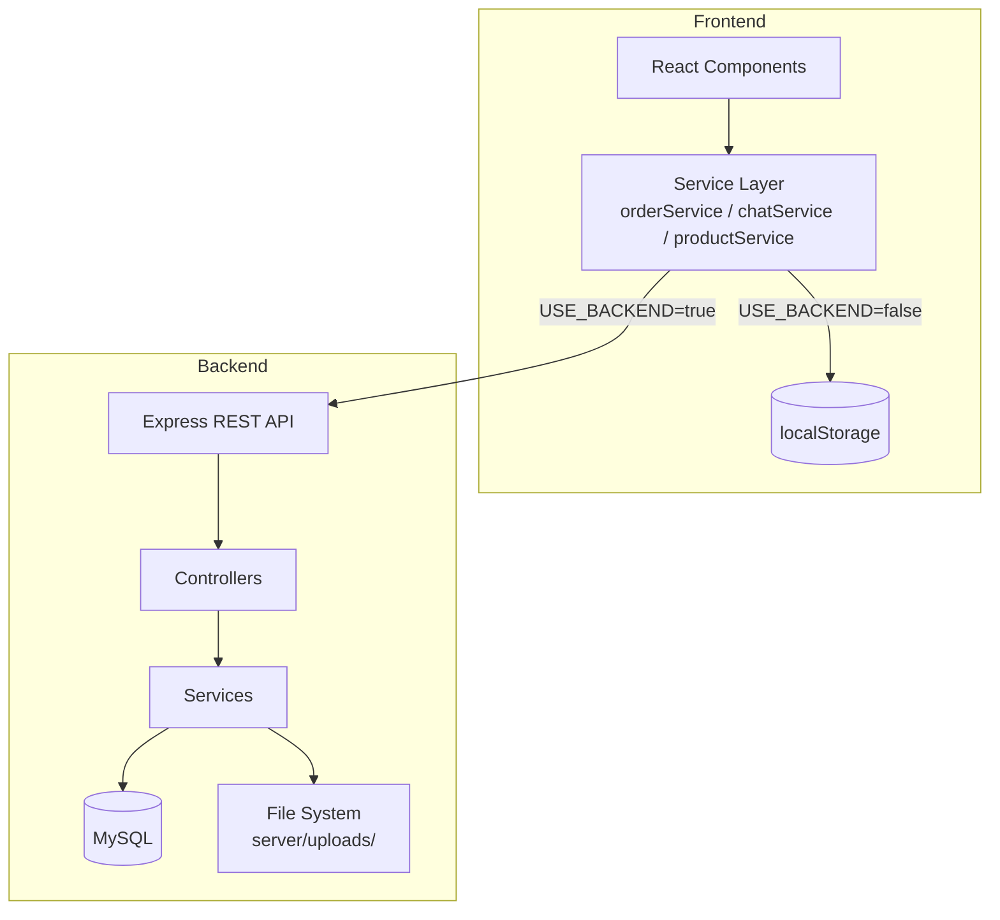

# Design Document — Order Enhancements

## Overview

This document covers the technical design for five incremental enhancements to the Gala Printing order and chat system:

1. **Dynamic Pricing** — variant-aware price display and cart storage
2. **Promo Code Bar** — server-validated discount codes at checkout
3. **Chat Close/Delete** — admin-triggered permanent conversation deletion
4. **Order Source Label** — "Custom Order" / "Offline Order" badge in the order detail modal
5. **Order Cancellation by Admin/Owner** — mandatory-reason cancellation with customer visibility

The system operates in dual mode: `USE_BACKEND=true` uses the REST API + MySQL; `USE_BACKEND=false` uses localStorage. All five features must support both modes.

---

## Architecture

The existing architecture is a React SPA (frontend) + Node.js/Express REST API (backend) with MySQL, connected via Socket.io for real-time events. The dual-mode pattern is already established throughout `src/services/`.



Each feature touches a specific slice of this stack:

| Feature | DB Schema | Backend | Frontend |
|---|---|---|---|
| Dynamic Pricing | `products.variant_prices` JSON column | `products.service.js` + `products.controller.js` | `CatalogProductPage.jsx` + `productService.js` |
| Promo Code Bar | New `promo_codes` table; `orders.promo_code`, `orders.discount_amount` columns | New `promo.service.js` + `promo.controller.js` + route | `CheckoutPage.jsx` + `orderService.js` |
| Chat Close/Delete | No schema change (cascade already exists) | New `deleteConversation` in `chat.service.js` + `chat.controller.js` + route | `ChatsSection.jsx` + `chatService.js` |
| Order Source Label | No schema change (`source` column exists) | No change | `OrderDetailModal.jsx` |
| Order Cancellation | `orders.cancellation_reason` column | `orders.service.js` + `orders.controller.js` | `OrdersSection.jsx` + `OrderDetailModal.jsx` + `orderService.js` |

---

## Components and Interfaces

### Feature 1: Dynamic Pricing

**Backend — `products.service.js`**

`createProduct` and `updateProduct` gain a `variantPrices` parameter. The value is a plain JSON object mapping a variant key to a price:

```
variant key format: "{color}|{size}|{material}"
empty segments are represented as empty string: "|A4|"
```

`getProductById` already returns all columns; `variant_prices` will be included automatically once the column exists.

**Backend — `products.controller.js`**

`createProduct` and `updateProduct` pass `variantPrices` through to the service. No new endpoints needed.

**Frontend — `productService.js`**

No changes needed; `getProductById` already returns the full product row.

**Frontend — `CatalogProductPage.jsx`**

New helper `resolveVariantPrice(product, color, size, material)`:
- Builds the variant key from the current selections
- Looks up `product.variantPrices[key]`
- Falls back to `product.price` if not found

The displayed price and the price passed to `addItem` both use this helper.

**Frontend — `CartContext` / `addItem`**

No changes needed; `addItem` already accepts an arbitrary `price` field.

---

### Feature 2: Promo Code Bar

**Backend — New `promo.service.js`**

```js
validatePromoCode(code, subtotal)
  → { ok, discount, discountAmount, finalSubtotal, promoCodeId }

incrementUsage(promoCodeId)
```

Validation rules:
- Code must exist in `promo_codes`
- `expires_at` must be null or in the future
- `usage_count < max_uses` (or `max_uses` is null = unlimited)

Discount calculation:
- `type = 'percentage'`: `discountAmount = subtotal * (value / 100)`
- `type = 'fixed'`: `discountAmount = value`
- `finalSubtotal = max(0, subtotal - discountAmount)`

**Backend — New `promo.controller.js`**

```
POST /api/promo/validate
  Body: { code, subtotal }
  Response: { ok, discount, discountAmount, finalSubtotal }
```

**Backend — `orders.service.js` / `orders.controller.js`**

`createOrder` accepts optional `promoCode` and `discountAmount`. These are stored in the new columns on `orders`. `incrementUsage` is called inside the same transaction.

**Frontend — `CheckoutPage.jsx`**

New state: `promoCode`, `promoDiscount`, `promoError`, `promoApplied`.

New UI block in the summary section:
- Input + "Terapkan" button
- On apply: calls `POST /api/promo/validate` (backend) or local lookup (localStorage mode)
- On success: shows discount line and "Hapus" button
- On remove: clears promo state, restores original subtotal

**Frontend — `orderService.js`**

`createOrderFromCart` accepts `promoCode` and `discountAmount` and passes them to the API / localStorage.

---

### Feature 3: Chat Close/Delete

**Backend — `chat.service.js`**

New function:

```js
deleteConversation(conversationId)
  → { deletedFilePaths: string[] }
```

Steps:
1. Fetch all messages with `type = 'file'` for the conversation
2. Collect `file_path` values
3. `DELETE FROM conversations WHERE id = ?` — cascade deletes messages automatically
4. Return the file paths for the controller to delete from disk

**Backend — `chat.controller.js`**

New handler:

```js
// DELETE /api/conversations/:id
deleteConversation(req, res, next)
```

- Role guard: `admin` only
- Calls `svc.deleteConversation(id)`
- Calls `StorageService.delete(path)` for each returned file path
- Returns `{ ok: true }`

**Backend — `chat.routes.js`**

```js
router.delete(
  '/:id',
  authenticate,
  requireRole('admin'),
  ctrl.deleteConversation
);
```

**Frontend — `chatService.js`**

New function:

```js
deleteConversation(conversationId)
  // USE_BACKEND=true: DELETE /api/conversations/:id
  // USE_BACKEND=false: removes from localStorage gala.chats
```

localStorage path: filter out the conversation and all its messages from `data.conversations` and `data.messages`, then `saveLocal(data)`.

**Frontend — `ChatsSection.jsx`**

- "Tutup Chat" button in `chat-main-header`
- Confirmation dialog (native `window.confirm` or a simple inline modal)
- On confirm: calls `deleteConversation`, then reloads conversation list
- On server error: shows error message, does NOT modify localStorage

---

### Feature 4: Order Source Label

This feature is purely frontend — no backend or schema changes.

**Frontend — `OrderDetailModal.jsx`**

In the header section, after the order number, add a conditional badge:

```jsx
{order.source === 'custom'  && <span className="odm-source-badge odm-source-badge--custom">Custom Order</span>}
{order.source === 'offline' && <span className="odm-source-badge odm-source-badge--offline">Offline Order</span>}
```

The `source` field is already mapped in `mapOrder()` in `orderService.js` (`row.source ?? "online"`), so it is available on every order object passed to the modal.

No changes to `OrdersSection.jsx`, `orderService.js`, or the backend are needed.

---

### Feature 5: Order Cancellation by Admin/Owner

**Backend — `orders.service.js`**

`updateOrderStatus` already handles `Cancelled` for `admin`. Changes:

1. Add `owner` to `TRANSITIONS` with the same cancellation rights as `admin` (all statuses except `Finished` and `Cancelled`).
2. Accept an optional `cancellationReason` parameter.
3. When `newStatus === 'Cancelled'`, store `cancellationReason` in the new column.
4. Pass `cancellationReason` to `insertHistoryEntry` so it is recorded in `order_history`.

Updated `TRANSITIONS.owner`:
```js
owner: {
  'Waiting for Payment':         ['Cancelled'],
  'Payment Accepted':            ['Cancelled'],
  'Waiting for Design Approval': ['Cancelled'],
  'Design Accepted':             ['Cancelled'],
  'On Progress':                 ['Cancelled'],
  'Quality Checking':            ['Cancelled'],
  'In Delivery':                 ['Cancelled'],
},
```

**Backend — `orders.controller.js`**

`updateOrderStatus` reads `cancellationReason` from `req.body` and passes it to the service. Validation: if `newStatus === 'Cancelled'` and `cancellationReason` is empty/missing, return 422.

**Backend — `order_history` table**

The existing `order_history` table needs a `cancellation_reason` column (added via migration). `insertHistoryEntry` gains an optional `cancellationReason` parameter.

**Frontend — `orderService.js`**

`updateOrderStatus` passes `cancellationReason` in the PATCH body.

**Frontend — `OrdersSection.jsx`**

When the selected status is `Cancelled`, show a modal/inline dialog requiring a non-empty reason before confirming. The reason is passed to `updateOrderStatus`.

**Frontend — `OrderDetailModal.jsx`**

When `order.status === 'Cancelled'` and `order.cancellationReason` is present, display it in a dedicated section visible to all viewers (including customers via `MyOrdersPage`).

**Frontend — `MyOrdersPage.jsx` / `StatusOrderPage.jsx`**

These pages already display order status. The `cancellationReason` field (mapped in `mapOrder`) will be shown when present.

---

## Data Models

### New column: `products.variant_prices`

```sql
-- Migration: 017_add_variant_prices_to_products.sql
ALTER TABLE products
  ADD COLUMN variant_prices JSON DEFAULT NULL
  AFTER materials;
```

Shape of the JSON value:
```json
{
  "Merah|A4|Vinyl": 15000,
  "Biru|A3|Vinyl":  20000,
  "|A4|":           12000
}
```

Keys use `|` as separator. Empty segments represent "any" or "not applicable".

---

### New table: `promo_codes`

```sql
-- Migration: 018_create_promo_codes.sql
CREATE TABLE IF NOT EXISTS promo_codes (
  id          CHAR(36)      NOT NULL PRIMARY KEY,
  code        VARCHAR(50)   NOT NULL UNIQUE,
  type        ENUM('percentage','fixed') NOT NULL DEFAULT 'percentage',
  value       DECIMAL(10,2) NOT NULL,
  max_uses    INT           DEFAULT NULL,
  usage_count INT           NOT NULL DEFAULT 0,
  expires_at  DATETIME      DEFAULT NULL,
  created_at  DATETIME      NOT NULL DEFAULT CURRENT_TIMESTAMP
) ENGINE=InnoDB DEFAULT CHARSET=utf8mb4;
```

---

### New columns: `orders.promo_code`, `orders.discount_amount`

```sql
-- Migration: 019_add_promo_to_orders.sql
ALTER TABLE orders
  ADD COLUMN promo_code      VARCHAR(50)   DEFAULT NULL AFTER subtotal,
  ADD COLUMN discount_amount DECIMAL(15,2) NOT NULL DEFAULT 0 AFTER promo_code;
```

---

### New column: `orders.cancellation_reason`

```sql
-- Migration: 020_add_cancellation_reason_to_orders.sql
ALTER TABLE orders
  ADD COLUMN cancellation_reason TEXT DEFAULT NULL AFTER admin_note;
```

---

### New column: `order_history.cancellation_reason`

```sql
-- Migration: 021_add_cancellation_reason_to_order_history.sql
ALTER TABLE order_history
  ADD COLUMN cancellation_reason TEXT DEFAULT NULL;
```

---

### Updated `mapOrder` in `orderService.js`

```js
cancellationReason: row.cancellation_reason ?? row.cancellationReason ?? null,
promoCode:          row.promo_code          ?? row.promoCode          ?? null,
discountAmount:     Number(row.discount_amount ?? row.discountAmount ?? 0),
```

---

## Correctness Properties

*A property is a characteristic or behavior that should hold true across all valid executions of a system — essentially, a formal statement about what the system should do. Properties serve as the bridge between human-readable specifications and machine-verifiable correctness guarantees.*

### Property 1: Variant price lookup correctness

*For any* product with a non-empty `variantPrices` map, and *for any* variant combination (color, size, material) that exists as a key in that map, calling `resolveVariantPrice(product, color, size, material)` SHALL return the exact price stored in the map for that key.

**Validates: Requirements 1.2, 1.3, 1.4**

---

### Property 2: Variant price fallback to base price

*For any* product and *for any* variant combination (color, size, material) whose derived key is NOT present in `variantPrices` (or when `variantPrices` is null/empty), calling `resolveVariantPrice(product, color, size, material)` SHALL return the product's base `price`.

**Validates: Requirements 1.5**

---

### Property 3: Variant prices round-trip persistence

*For any* valid `variantPrices` JSON object saved to a product record, retrieving that product from the database SHALL return a `variantPrices` object that is deeply equal to the one that was saved.

**Validates: Requirements 1.6**

---

### Property 4: Promo code discount calculation correctness

*For any* valid promo code with `type = 'percentage'` and value `v`, and *for any* subtotal `s > 0`, applying the code SHALL produce `discountAmount = s * (v / 100)` and `finalSubtotal = s - discountAmount`. For `type = 'fixed'` and value `v`, `discountAmount = min(v, s)` and `finalSubtotal = max(0, s - v)`.

**Validates: Requirements 2.2**

---

### Property 5: Invalid/expired promo code rejection

*For any* code string that does not exist in `promo_codes`, or whose `expires_at` is in the past, or whose `usage_count >= max_uses`, the validation function SHALL return `{ ok: false }` and SHALL NOT apply any discount.

**Validates: Requirements 2.3, 2.8**

---

### Property 6: Promo code apply-then-remove round trip

*For any* valid promo code applied to a checkout session, removing the promo code SHALL restore the displayed subtotal to its original value (before the code was applied), with no discount remaining.

**Validates: Requirements 2.5**

---

### Property 7: Promo code persisted on order

*For any* order created with a valid promo code, retrieving that order SHALL return `promoCode` equal to the applied code and `discountAmount` equal to the computed discount.

**Validates: Requirements 2.6**

---

### Property 8: Conversation deletion removes all messages

*For any* conversation with any number of messages, deleting the conversation SHALL result in zero messages remaining in the database with that `conversation_id`.

**Validates: Requirements 3.3**

---

### Property 9: Conversation deletion cleans up files and localStorage

*For any* conversation containing file messages, after deletion: (a) all `file_path` values referenced by those messages SHALL no longer exist on the server filesystem, and (b) the conversation SHALL no longer appear in the `gala.chats` localStorage key.

**Validates: Requirements 3.4, 3.5**

---

### Property 10: Only admin can delete conversations

*For any* role that is not `admin`, a DELETE request to `/api/conversations/:id` SHALL return HTTP 403 and SHALL NOT delete the conversation or its messages.

**Validates: Requirements 3.7**

---

### Property 11: Order source badge rendering

*For any* order object, the `OrderDetailModal` SHALL render a "Custom Order" badge if and only if `source === 'custom'`, an "Offline Order" badge if and only if `source === 'offline'`, and no source badge if `source === 'online'` or source is absent.

**Validates: Requirements 4.1, 4.2, 4.3**

---

### Property 12: Empty cancellation reason is rejected

*For any* string composed entirely of whitespace (including the empty string), submitting it as a `cancellationReason` SHALL be rejected by the system (HTTP 422 on the backend; UI validation error on the frontend), and the order status SHALL remain unchanged.

**Validates: Requirements 5.3**

---

### Property 13: Cancellation stores reason and updates status

*For any* order in a cancellable status and *for any* non-empty `cancellationReason`, confirming cancellation SHALL set `order.status = 'Cancelled'` and `order.cancellationReason` equal to the provided reason.

**Validates: Requirements 5.4, 5.5, 5.7**

---

### Property 14: Cancellation is allowed on all non-terminal statuses

*For any* order whose status is not `Finished` or `Cancelled`, an admin or owner SHALL be permitted to cancel it (the transition SHALL be in `getAllowedNextStatuses`). *For any* order whose status IS `Finished` or `Cancelled`, the cancellation SHALL be rejected.

**Validates: Requirements 5.8**

---

## Error Handling

### Dynamic Pricing
- If `variant_prices` JSON is malformed in the DB, `parseArrayField`-style parsing falls back to `null`; `resolveVariantPrice` then returns the base price.
- If the frontend receives a product without `variantPrices`, it silently uses `product.price`.

### Promo Code Bar
- Network error on `/api/promo/validate`: show a generic "Gagal memvalidasi kode promo" error; do not apply any discount.
- Race condition (code used up between validate and order creation): the `createOrder` transaction re-validates inside the DB transaction; if the code is now exhausted, the order is created without the discount and the frontend receives a warning.
- `discountAmount > subtotal`: clamped to `subtotal` so `finalSubtotal` is never negative.

### Chat Close/Delete
- Server error on DELETE: the frontend catches the error, shows a toast/alert, and does NOT remove the conversation from localStorage.
- Partial file deletion failure: `StorageService.delete` already silently ignores missing files; the conversation row is still deleted from the DB.
- Concurrent deletion (two admins): the second DELETE returns 404 (conversation already gone); the frontend treats 404 as a successful deletion.

### Order Source Label
- If `order.source` is undefined or an unexpected value, no badge is rendered (safe default).

### Order Cancellation
- Missing `cancellationReason` on the backend: controller returns 422 before reaching the service.
- Attempting to cancel a `Finished` or `Cancelled` order: service throws a 403 error (existing transition guard).
- File deletion on cancellation: already handled by `StorageService.delete` (silently ignores missing files).

---

## Testing Strategy

The project uses **Vitest** with **fast-check** for property-based testing (see `server/package.json`). All new property tests follow the existing pattern in `server/src/tests/`.

### Unit / Example Tests

- `resolveVariantPrice` with known inputs (base price fallback, exact key match, partial key match)
- `validatePromoCode` with a fixed set of valid/invalid/expired codes
- `OrderDetailModal` renders correct badge for each `source` value
- `ChatsSection` shows "Tutup Chat" button when a conversation is active
- Cancellation dialog appears and blocks submission when reason is empty

### Property-Based Tests (fast-check)

Each property below maps to one property-based test in `server/src/tests/orderEnhancements.property.test.js`:

| Test | Property | fast-check arbitraries |
|---|---|---|
| Variant price lookup | Property 1 | `fc.record({ color, size, material, price })` + random map |
| Variant price fallback | Property 2 | Random product + variant key NOT in map |
| Variant prices round-trip | Property 3 | `fc.dictionary(fc.string(), fc.float({ min: 0 }))` |
| Promo discount calculation | Property 4 | `fc.record({ type, value, subtotal })` |
| Invalid promo rejection | Property 5 | Random invalid/expired code objects |
| Promo apply-remove round trip | Property 6 | Random valid promo + subtotal |
| Promo persisted on order | Property 7 | Random order + promo code |
| Conversation deletion removes messages | Property 8 | Random conversation with N messages |
| Deletion cleans files + localStorage | Property 9 | Random conversation with file messages |
| Only admin can delete | Property 10 | `fc.constantFrom('customer','cashier','cs','qc','owner')` |
| Source badge rendering | Property 11 | `fc.constantFrom('online','offline','custom')` |
| Empty reason rejected | Property 12 | `fc.string().filter(s => s.trim() === '')` |
| Cancellation stores reason + status | Property 13 | Random cancellable status + non-empty reason |
| Cancellation allowed on non-terminal | Property 14 | `fc.constantFrom(...ORDER_STATUSES)` |

**Configuration**: minimum 100 iterations per property test.

**Tag format**: `// Feature: order-enhancements, Property N: <property text>`

### Integration Tests

- `POST /api/promo/validate` with a real DB row (smoke: table exists, endpoint reachable)
- `DELETE /api/conversations/:id` end-to-end (conversation + messages deleted, files cleaned)
- `PATCH /api/orders/:id/status` with `newStatus=Cancelled` and a reason (DB row updated)

### Dual-Mode Coverage

For features that touch `orderService.js` or `chatService.js`, tests run in both `USE_BACKEND=true` (mocked API) and `USE_BACKEND=false` (localStorage) modes to ensure parity.
