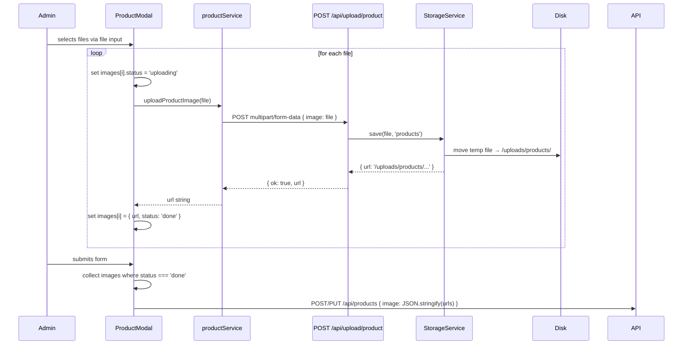
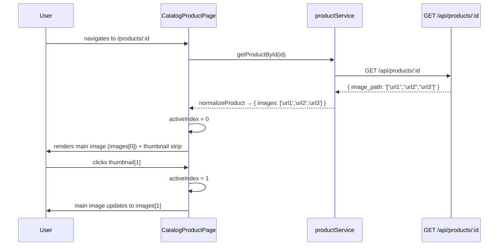

# Design Document: Product Image Upload

## Overview

This feature replaces the current broken image flow — where `blob:` object URLs are stored and sent to the backend — with a real upload pipeline. When an admin selects product images in the `ProductModal`, each file is immediately uploaded to a new `POST /api/upload/product` endpoint, which persists the file to disk via the existing `StorageService` and returns a permanent server URL. The modal then stores those real URLs in its `images` state, so by the time the product form is submitted, `image: JSON.stringify(images)` contains valid, resolvable paths.

Beyond the core upload fix, the feature also improves the admin image card UI (drag-and-drop zone, per-image upload progress, reordering), adds a thumbnail column to the admin product table, and replaces the static gallery placeholder on the public product detail page with a real interactive image gallery driven by the stored image array.

## Architecture

```mermaid
graph TD
    A[Admin: ProductModal] -->|multipart/form-data| B[POST /api/upload/product]
    B --> C[uploadProduct multer middleware]
    C --> D[uploadProductImage controller]
    D --> E[StorageService.save file, 'products']
    E --> F[/uploads/products/filename.jpg]
    D -->|{ ok: true, url }| A
    A -->|images: JSON array of real URLs| G[POST/PUT /api/products]
    G --> H[products.controller createProduct / updateProduct]
    H --> I[products.service image_path stored as JSON array]

    J[Public: CatalogProductPage] -->|GET /api/products/:id| I
    I -->|image_path JSON array| J
    J --> K[Real image gallery with thumbnails]

    L[Admin: ProductsSection table] -->|normalizeProduct.images[0]| M[Thumbnail column]
    N[ProductCard] -->|normalizeProduct.image| O[First image or placeholder]
```

## Sequence Diagrams

### Upload-on-Select Flow



### Public Gallery Interaction



## Components and Interfaces

### Component 1: `POST /api/upload/product` Endpoint

**Purpose**: Accept a single product image file, persist it to disk, and return the permanent URL.

**Interface**:
```
POST /api/upload/product
Authorization: Bearer <token>  (authenticate + requireRole('admin','owner'))
Content-Type: multipart/form-data

Body field: image  (single file, jpeg/png/webp, max 10 MB)

Response 200:
  { ok: true, url: "/uploads/products/1234567890-uuid.jpg" }

Response 400:
  { ok: false, message: "File gambar wajib diunggah." }

Response 413:
  { ok: false, message: "File terlalu besar. Maksimal 10MB." }

Response 415:
  { ok: false, message: "Tipe file '...' tidak didukung untuk upload product." }
```

**Responsibilities**:
- Validate file presence (400 if missing)
- Delegate to `StorageService.save(req.file, 'products')`
- Return `{ ok: true, url }` on success

---

### Component 2: `uploadProduct` Multer Config (`server/src/middleware/upload.js`)

**Purpose**: Multer instance for product image uploads — mirrors `uploadAvatar` config.

**Interface**:
```javascript
export const uploadProduct = buildUpload('product');
// ALLOWED_MIME.product = ['image/jpeg', 'image/png', 'image/webp']
// MAX_SIZE.product     = 10 * 1024 * 1024  // 10 MB
```

**Responsibilities**:
- Reject non-image MIME types with 415
- Reject files over 10 MB with 413
- Store temp file in `os.tmpdir()`

---

### Component 3: `uploadProductImage` Controller (`server/src/controllers/products.controller.js`)

**Purpose**: Handle the upload request, call StorageService, return URL.

**Interface**:
```javascript
export async function uploadProductImage(req, res, next)
// req.file: Express.Multer.File
// Returns: { ok: true, url: string }
```

**Responsibilities**:
- Guard: return 400 if `req.file` is absent
- Call `StorageService.save(req.file, 'products')`
- Return `{ ok: true, url: saved.url }`

---

### Component 4: `uploadProductImage` Service Function (`src/services/productService.js`)

**Purpose**: Frontend service function that POSTs a single file and returns the server URL.

**Interface**:
```javascript
export async function uploadProductImage(file: File): Promise<string>
// Throws on network error or non-ok response
// Returns the url string from { ok: true, url }
```

**Responsibilities**:
- Build `FormData` with `formData.append('image', file)`
- POST to `/api/upload/product`
- Return `res.data.url`

---

### Component 5: `ProductModal` Image Upload Card (refactored)

**Purpose**: Replace the plain `<input type="file">` with a styled upload zone that uploads immediately on select, shows per-image progress, supports reordering, and only stores real server URLs.

**Interface** (internal state shape):
```javascript
// Each entry in the images array:
{
  url: string,       // server URL after upload, or blob: during upload
  status: 'uploading' | 'done' | 'error',
  error?: string,    // error message if status === 'error'
  file?: File,       // original File object (only during upload)
}
```

**Responsibilities**:
- On file select: create `{ url: URL.createObjectURL(f), status: 'uploading', file: f }` entries
- Call `uploadProductImage(f)` per file concurrently
- On success: update entry to `{ url: serverUrl, status: 'done' }`
- On failure: update entry to `{ status: 'error', error: message }`
- On form submit: filter to `status === 'done'` entries, collect `url` values
- Show "Foto 1" badge on first image
- Show count badge `{done}/{total}` (e.g. "3/8")
- Allow reorder via move-left / move-right arrow buttons
- Allow remove per image (only removes from local state; no server-side delete)
- Show spinner overlay on images with `status === 'uploading'`

---

### Component 6: Admin Product Table Thumbnail Column

**Purpose**: Show a small thumbnail of the first product image in the `ProductsSection` table.

**Interface**:
```jsx
// In the <thead>:
<th>Foto</th>
<th>Nama</th>
...

// In each <tr>:
<td>
   { e.currentTarget.src = placeholderImg }}
  />
</td>
```

**Responsibilities**:
- Use `normalizeProduct` output's `images[0]` (already handled by `productService.js`)
- Fall back to placeholder if no images

---

### Component 7: `CatalogProductPage` Real Image Gallery

**Purpose**: Replace the static placeholder gallery with a real interactive gallery driven by `product.images`.

**Interface** (internal state):
```javascript
const [activeIndex, setActiveIndex] = useState(0)
// product.images: string[]  — from normalizeProduct
```

**Responsibilities**:
- Display `product.images[activeIndex]` as the main image (fallback to `placeholderImg` if empty)
- Render thumbnail strip from `product.images`
- Highlight active thumbnail
- Prev/Next buttons cycle through images (wraps around)
- Clicking a thumbnail sets `activeIndex`
- Falls back gracefully when `product.images` is empty (shows placeholder, hides nav)

---

### Component 8: `ProductCard` (verification only)

**Purpose**: Already uses `product.image` (first image from `normalizeProduct`). No changes needed.

**Verification**: `normalizeProduct` in `productService.js` already extracts `images[0]` into `image`. `ProductCard` uses `product?.image || placeholderImg`. This is correct.

---

## Data Models

### Image Array Storage Format

Product images are stored in the `image_path` column of the `products` table as a JSON-encoded array of URL strings.

```
image_path (TEXT):
  '[]'                                          — no images
  '["/uploads/products/abc.jpg"]'               — single image
  '["/uploads/products/abc.jpg","/uploads/products/def.png"]'  — multiple
```

**Validation Rules**:
- Array length: 1–8 items (enforced on frontend before submit)
- Each URL: must start with `/uploads/products/` (server-generated, not blob:)
- MIME types accepted: `image/jpeg`, `image/png`, `image/webp`
- Max file size per image: 10 MB

### `normalizeProduct` Output Shape (frontend)

```javascript
{
  id: string,
  name: string,
  category: string,
  price: number,
  image: string | null,      // images[0] or null — used by ProductCard
  images: string[],          // full array — used by gallery and modal
  shortDescription: string,
  requiresDesign: boolean,
  colors: string[],
  sizes: string[],
  materials: string[],
  variantPrices: object | null,
}
```

The `normalizeProduct` function in `productService.js` already handles this correctly — it parses `image_path` as a JSON array and populates both `image` (first element) and `images` (full array).

### Upload Response Shape

```javascript
// POST /api/upload/product → 200
{ ok: true, url: "/uploads/products/1700000000000-uuid.jpg" }

// Error responses
{ ok: false, message: string }
```

---

## Key Functions with Formal Specifications

### `uploadProductImage(file)` — frontend service

```javascript
async function uploadProductImage(file: File): Promise<string>
```

**Preconditions**:
- `file` is a valid `File` object (not null)
- `file.type` is one of `image/jpeg`, `image/png`, `image/webp`
- `file.size <= 10 * 1024 * 1024`
- User is authenticated as admin or owner

**Postconditions**:
- Returns a string starting with `/uploads/products/`
- The returned URL is accessible via `GET /uploads/products/<filename>`
- Throws an `Error` if the server returns a non-ok response or network fails

**Loop Invariants**: N/A (no loops)

---

### `handleImageUpload(e)` — ProductModal event handler

```javascript
async function handleImageUpload(e: React.ChangeEvent<HTMLInputElement>): Promise<void>
```

**Preconditions**:
- `e.target.files` contains 1 or more files
- `images.length + e.target.files.length <= 8`

**Postconditions**:
- For each file: an entry is added to `images` state with `status: 'uploading'`
- After each upload resolves: entry is updated to `status: 'done'` with real server URL
- After each upload rejects: entry is updated to `status: 'error'` with error message
- `images.length` increases by the number of files selected (up to the 8-image cap)

**Loop Invariants**:
- All previously uploaded images remain in `images` state unchanged
- `images.length <= 8` at all times

---

### `handleSubmit(e)` — ProductModal form submit (modified)

**Preconditions**:
- At least one image with `status === 'done'` exists in `images`
- No images with `status === 'uploading'` remain (all uploads have settled)

**Postconditions**:
- `data.image` is `JSON.stringify(images.filter(i => i.status === 'done').map(i => i.url))`
- All URLs in the array start with `/uploads/products/`
- No `blob:` URLs are included in the submitted data

---

### `StorageService.save(file, 'products')` — backend

**Preconditions**:
- `file` is a valid multer file object with `.path` pointing to a temp file
- `'products'` is in the `SUBDIRS` array in `storage.js`
- The `uploads/products/` directory exists (created by `ensureUploadDirs`)

**Postconditions**:
- Returns `{ path: 'uploads/products/<filename>', url: '/uploads/products/<filename>', fileName }`
- The file is moved from `os.tmpdir()` to `uploads/products/`
- `fileName` is unique: `${Date.now()}-${randomUUID()}${ext}`

---

## Algorithmic Pseudocode

### Upload-on-Select Algorithm

```pascal
PROCEDURE handleImageUpload(files)
  INPUT: files — array of File objects from <input type="file">
  OUTPUT: side effect — updates images state

  BEGIN
    IF images.length + files.length > 8 THEN
      SET imageError ← 'Maksimal 8 foto diperbolehkan.'
      RETURN
    END IF

    // Create placeholder entries immediately (optimistic UI)
    FOR each file IN files DO
      entry ← { url: URL.createObjectURL(file), status: 'uploading', file: file }
      APPEND entry TO images
    END FOR

    // Upload concurrently
    FOR each (file, index) IN files DO
      TRY
        serverUrl ← AWAIT uploadProductImage(file)
        UPDATE images[index] ← { url: serverUrl, status: 'done' }
      CATCH error
        UPDATE images[index] ← { url: '', status: 'error', error: error.message }
      END TRY
    END FOR
  END
END PROCEDURE
```

**Loop Invariants**:
- All entries added before the loop remain in `images` state
- `images.length <= 8` throughout

---

### Form Submit Guard Algorithm

```pascal
PROCEDURE handleSubmit(e)
  INPUT: form submit event
  OUTPUT: calls addProduct or updateProduct with real image URLs

  BEGIN
    e.preventDefault()

    doneImages ← FILTER images WHERE status = 'done'
    uploadingImages ← FILTER images WHERE status = 'uploading'

    IF doneImages.length = 0 THEN
      SET formError ← 'Minimal 1 gambar produk wajib diunggah.'
      RETURN
    END IF

    IF uploadingImages.length > 0 THEN
      SET formError ← 'Tunggu hingga semua foto selesai diunggah.'
      RETURN
    END IF

    imageUrls ← MAP doneImages TO url
    data.image ← JSON.stringify(imageUrls)

    // Proceed with existing product save logic...
  END
END PROCEDURE
```

---

### Gallery Navigation Algorithm

```pascal
PROCEDURE handleGalleryNav(direction)
  INPUT: direction — 'prev' | 'next'
  OUTPUT: side effect — updates activeIndex state

  BEGIN
    n ← images.length
    IF n = 0 THEN RETURN END IF

    IF direction = 'next' THEN
      SET activeIndex ← (activeIndex + 1) MOD n
    ELSE
      SET activeIndex ← (activeIndex - 1 + n) MOD n
    END IF
  END
END PROCEDURE
```

---

## Example Usage

### Frontend: Uploading and Submitting

```javascript
// productService.js — new function
export async function uploadProductImage(file) {
  const formData = new FormData();
  formData.append('image', file);
  const res = await api.post('/api/upload/product', formData, {
    headers: { 'Content-Type': 'multipart/form-data' },
  });
  if (!res.data.ok) throw new Error(res.data.message || 'Upload gagal.');
  return res.data.url;
}

// ProductModal — handleImageUpload (simplified)
async function handleImageUpload(e) {
  const files = Array.from(e.target.files || []);
  if (images.length + files.length > 8) {
    setImageError('Maksimal 8 foto diperbolehkan.');
    return;
  }
  const startIdx = images.length;
  const placeholders = files.map(f => ({
    url: URL.createObjectURL(f), status: 'uploading', file: f,
  }));
  setImages(prev => [...prev, ...placeholders]);

  await Promise.allSettled(
    files.map(async (file, i) => {
      try {
        const serverUrl = await uploadProductImage(file);
        setImages(prev => prev.map((img, idx) =>
          idx === startIdx + i ? { url: serverUrl, status: 'done' } : img
        ));
      } catch (err) {
        setImages(prev => prev.map((img, idx) =>
          idx === startIdx + i ? { ...img, status: 'error', error: err.message } : img
        ));
      }
    })
  );
}
```

### Backend: Upload Route and Controller

```javascript
// products.routes.js — new route
router.post(
  '/upload-image',
  authenticate,
  requireRole('admin', 'owner'),
  uploadProduct.single('image'),
  ctrl.uploadProductImage
);

// products.controller.js — new handler
export async function uploadProductImage(req, res, next) {
  if (!req.file) {
    return res.status(400).json({ ok: false, message: 'File gambar wajib diunggah.' });
  }
  try {
    const saved = await StorageService.save(req.file, 'products');
    return res.json({ ok: true, url: saved.url });
  } catch (err) {
    next(err);
  }
}
```

### Public Gallery JSX (CatalogProductPage)

```jsx
const images = product.images || [];
const hasImages = images.length > 0;

<section className="gallery" aria-label="Galeri produk">
  <div className="gallery-main">
     { e.currentTarget.src = placeholderImg; }}
    />
  </div>
  {hasImages && (
    <div className="gallery-thumbs-row">
      <button
        className="gallery-nav-btn"
        type="button"
        aria-label="Sebelumnya"
        onClick={() => setActiveIndex(i => (i - 1 + images.length) % images.length)}
      >
        &#8249;
      </button>
      <div className="gallery-thumbs">
        {images.map((url, i) => (
          <button
            key={i}
            type="button"
            className={`gallery-thumb${i === activeIndex ? ' active' : ''}`}
            onClick={() => setActiveIndex(i)}
            aria-label={`Foto ${i + 1}`}
          >
             { e.currentTarget.src = placeholderImg; }} />
          </button>
        ))}
      </div>
      <button
        className="gallery-nav-btn"
        type="button"
        aria-label="Berikutnya"
        onClick={() => setActiveIndex(i => (i + 1) % images.length)}
      >
        &#8250;
      </button>
    </div>
  )}
</section>
```

---

## Correctness Properties

*A property is a characteristic or behavior that should hold true across all valid executions of a system — essentially, a formal statement about what the system should do. Properties serve as the bridge between human-readable specifications and machine-verifiable correctness guarantees.*

### Property 1: Upload response URL format

For any valid image file (MIME type in `[image/jpeg, image/png, image/webp]`, size ≤ 10 MB) submitted to the Upload_Endpoint, the returned `url` SHALL match the pattern `/^\/uploads\/products\/.+\.(jpg|jpeg|png|webp)$/i`.

**Validates: Requirements 1.1, 1.7**

---

### Property 2: Unsupported MIME types are rejected

For any file whose MIME type is not `image/jpeg`, `image/png`, or `image/webp`, the Upload_Endpoint SHALL return HTTP 415.

**Validates: Requirements 1.4, 2.1**

---

### Property 3: No blob URLs in submitted product data

For any combination of successful and failed uploads in the ProductModal, the image array passed to the product save API SHALL contain only strings starting with `/uploads/products/` and no strings starting with `blob:`.

**Validates: Requirements 5.1, 5.2, 4.7**

---

### Property 4: Image count invariant

For any sequence of file selections in the ProductModal, `images.length` SHALL never exceed 8 at any point in time.

**Validates: Requirements 4.2**

---

### Property 5: Upload state transitions are correct

For any file selected in the ProductModal, the corresponding Image_Entry SHALL transition from `status: 'uploading'` to either `status: 'done'` (with a Server_URL) or `status: 'error'` (with an error message), and SHALL never remain in `status: 'uploading'` after the upload settles.

**Validates: Requirements 4.3, 4.4**

---

### Property 6: Gallery index bounds

For any `product.images` array with length > 0 and any sequence of prev/next navigation actions, `activeIndex` SHALL always be in the range `[0, product.images.length - 1]`.

**Validates: Requirements 7.3, 7.4**

---

### Property 7: normalizeProduct idempotency

For any raw product object, `normalizeProduct(normalizeProduct(raw))` SHALL deep-equal `normalizeProduct(raw)`.

**Validates: Requirements 8.1, 8.2, 8.3, 8.4**

---

### Property 8: Image reordering preserves all entries

For any images array and any sequence of move-left / move-right operations, the resulting array SHALL contain the same Image_Entry objects as the original array (same length, same elements, different order).

**Validates: Requirements 4.9**

---

### Property 9: StorageService subdir isolation

For any file uploaded via the Upload_Endpoint, the stored file path SHALL be under `uploads/products/` and SHALL NOT overlap with `uploads/avatars/`, `uploads/designs/`, or any other subdirectory.

**Validates: Requirements 1.7**

---

### Property 10: StorageService filename uniqueness

For any two distinct upload operations, the filenames generated by StorageService SHALL be different.

**Validates: Requirements 1.8**

---

## Error Handling

### Error Scenario 1: File Too Large

**Condition**: Admin selects a file > 10 MB
**Response**: Multer rejects with 413; `uploadProductImage` throws; image entry shows `status: 'error'` with message "File terlalu besar. Maksimal 10MB."
**Recovery**: Admin can remove the errored image and select a smaller file

### Error Scenario 2: Unsupported File Type

**Condition**: Admin selects a non-image file (e.g. PDF, GIF)
**Response**: Multer rejects with 415; image entry shows `status: 'error'` with message about unsupported type
**Recovery**: Admin removes the errored entry and selects a valid image

### Error Scenario 3: Network Error During Upload

**Condition**: Network fails mid-upload
**Response**: `uploadProductImage` throws a network error; image entry shows `status: 'error'`
**Recovery**: Admin can remove the errored entry and retry

### Error Scenario 4: Submit with Pending Uploads

**Condition**: Admin clicks submit while some images still have `status: 'uploading'`
**Response**: `handleSubmit` shows `formError`: "Tunggu hingga semua foto selesai diunggah."
**Recovery**: Wait for uploads to complete, then submit

### Error Scenario 5: Submit with No Successful Images

**Condition**: All selected images failed to upload (all `status: 'error'`)
**Response**: `handleSubmit` shows `formError`: "Minimal 1 gambar produk wajib diunggah."
**Recovery**: Admin must successfully upload at least one image

### Error Scenario 6: Gallery Image Load Failure

**Condition**: A stored image URL is broken (file deleted from disk)
**Response**: `onError` handler on `` replaces `src` with `placeholderImg`
**Recovery**: Graceful degradation — no crash, placeholder shown

---

## Testing Strategy

### Unit Testing Approach

- `uploadProductImage(file)` — mock `api.post`, verify FormData construction and URL extraction
- `normalizeProduct(raw)` — test with JSON array string, single URL string, null, and placeholder value
- `resolveVariantPrice` — existing tests cover this; no changes needed
- `handleImageUpload` — test that blob URLs are replaced with server URLs after upload resolves
- `handleSubmit` guard — test that blob/error URLs are excluded from submitted data

### Property-Based Testing Approach

**Property Test Library**: `fast-check` (already used in the project)

Key properties to test:

1. **Upload response URL format**: For any valid file upload, the returned URL always matches `/^\/uploads\/products\/.+\.(jpg|jpeg|png|webp)$/i`

2. **normalizeProduct idempotency**: `normalizeProduct(normalizeProduct(raw))` deep-equals `normalizeProduct(raw)` for any raw product shape

3. **Image count cap**: For any sequence of `handleImageUpload` calls, `images.length` never exceeds 8

4. **No blob URLs in submit payload**: For any combination of successful and failed uploads, `handleSubmit` never includes `blob:` URLs in `data.image`

5. **Gallery index wrapping**: For any `images.length > 0` and any sequence of prev/next navigations, `activeIndex` is always in `[0, images.length - 1]`

### Integration Testing Approach

- `POST /api/upload/product` with a real multer file — verify file appears on disk and URL is returned
- `POST /api/products` with a JSON image array — verify `image_path` stored correctly in DB
- `GET /api/products/:id` — verify `image_path` returned and parseable as JSON array

---

## Performance Considerations

- Uploads are fired concurrently (`Promise.allSettled`) rather than sequentially, so selecting 8 images triggers 8 parallel uploads. This is acceptable for admin use.
- Blob URLs created via `URL.createObjectURL` are revoked after the upload completes to avoid memory leaks: `URL.revokeObjectURL(entry.url)` should be called when replacing with the server URL.
- Thumbnail images in the admin table use `loading="lazy"` to avoid loading all thumbnails at once on large product lists.
- Gallery thumbnails are small (e.g. 60×60px rendered) but served at full resolution. Future optimization: generate resized thumbnails server-side.

---

## Security Considerations

- The upload endpoint requires `authenticate` + `requireRole('admin', 'owner')` — customers cannot upload product images.
- Multer's `fileFilter` rejects non-image MIME types (jpeg/png/webp only) with 415.
- File size is capped at 10 MB by multer's `limits.fileSize`.
- Files are stored with a UUID-based name (`${Date.now()}-${randomUUID()}${ext}`) to prevent path traversal and filename collisions.
- The `StorageService.save` function uses `path.resolve` and `path.join` to construct absolute paths, preventing directory traversal attacks.
- Uploaded files are served as static assets via `express.static` — no server-side execution of uploaded content.

---

## Dependencies

**Backend** (no new packages required):
- `multer` — already installed, used for `uploadAvatar`
- `StorageService` — already implemented in `server/src/utils/storage.js`

**Frontend** (no new packages required):
- `api` (axios instance) — already used in `productService.js`
- `FormData` — native browser API

**Files to modify**:
- `server/src/utils/storage.js` — add `'products'` to `SUBDIRS`
- `server/src/middleware/upload.js` — add `product` type to `ALLOWED_MIME`, `MAX_SIZE`, export `uploadProduct`
- `server/src/controllers/products.controller.js` — add `uploadProductImage` handler, import `StorageService`
- `server/src/routes/products.routes.js` — add `POST /upload-image` route
- `src/services/productService.js` — add `uploadProductImage` function
- `src/components/pages/admin/sections/ProductsSection.jsx` — refactor image card, add thumbnail column
- `src/components/pages/public/CatalogProductPage.jsx` — replace static gallery with real gallery
- `src/components/shared/ProductCard.jsx` — verify only (no changes expected)
