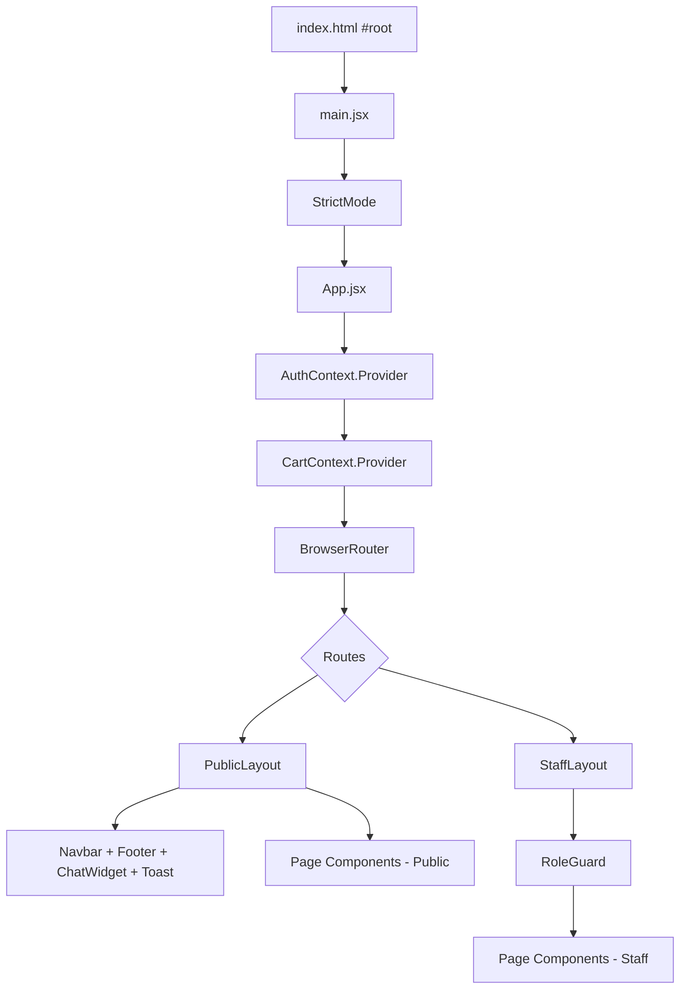

# Design Document — Vanilla to React Migration

## Overview

This document describes the technical design for migrating the `gala-printing` vanilla JavaScript MPA to a React SPA within the existing `gala-print-web` Vite scaffold. The migration is a structural refactoring: no new features are added, no business logic changes, and no data schema changes. The output is a component-based React SPA that renders identically to the original, is maintainable, and follows React best practices.

### Goals

- Replace the MPA HTML-per-page architecture with React Router v6 client-side routing.
- Replace `state.js` direct-mutation patterns with React Context + hooks (`AuthContext`, `CartContext`).
- Decompose each vanilla page into focused React components.
- Preserve all service modules, CSS files, and static assets without modification.
- Pass `vite build` and `eslint .` with zero errors.

### Non-Goals

- No new features or business logic changes.
- No CSS Modules or CSS-in-JS conversion.
- No service-layer refactoring to use React-specific APIs.
- No backend changes.

---

## Architecture

The application follows a standard React SPA architecture with a single entry point, a root context provider tree, and React Router v6 for client-side navigation.



### Boot Sequence

On application mount, `App.jsx` runs the vanilla boot sequence before rendering any route:

1. `seedStaffUsers()` — populates `localStorage` with default staff accounts if absent.
2. `hydrateUser()` — reads the persisted session from `localStorage` and initialises `AuthContext`.

This mirrors the vanilla `router.js` boot sequence exactly.

### Dependency Addition

`react-router-dom` must be added to `package.json` before any routing code is written:

```bash
npm install react-router-dom@^6
```

---

## Components and Interfaces

### Directory Structure

```
src/
├── main.jsx                    # Entry point — renders <App /> in StrictMode
├── App.jsx                     # Root component — providers + router
├── index.css                   # Imports src/styles/css/main.css
├── styles/
│   └── css/                    # Entire CSS tree (preserved as-is)
│       ├── base/
│       ├── components/
│       ├── layout/
│       ├── pages/
│       └── main.css
├── assets/                     # logo.png, placeholder.svg, hero.png, etc.
├── core/                       # Copied from vanilla js/core/ (no modification)
│   ├── config.js
│   ├── storage.js
│   ├── helpers.js
│   ├── validate.js
│   ├── notifications.js
│   └── httpClient.js
├── services/                   # Copied from vanilla js/services/ (no modification)
│   ├── authService.js
│   ├── cartService.js
│   ├── orderService.js
│   ├── productService.js
│   ├── categoryService.js
│   ├── chatService.js
│   ├── reviewService.js
│   └── analyticsService.js
└── components/
    ├── context/
    │   ├── AuthContext.jsx      # AuthContext + AuthProvider
    │   └── CartContext.jsx      # CartContext + CartProvider
    ├── guards/
    │   └── RoleGuard.jsx        # Role-based route protection
    ├── layout/
    │   ├── PublicLayout.jsx     # Navbar + Footer + ChatWidget wrapper
    │   └── StaffLayout.jsx      # Sidebar shell for staff dashboards
    ├── shared/
    │   ├── Navbar.jsx
    │   ├── Footer.jsx
    │   ├── ChatWidget.jsx
    │   ├── Toast.jsx
    │   ├── Modal.jsx            # Generic overlay base
    │   ├── PaymentModal.jsx
    │   ├── OrderDetailModal.jsx
    │   └── ProductCard.jsx
    ├── charts/
    │   └── Chart.jsx            # SVG chart wrapper (owner dashboard)
    ├── pages/
    │   ├── public/
    │   │   ├── HomePage.jsx
    │   │   ├── ProductsPage.jsx
    │   │   ├── CatalogProductPage.jsx
    │   │   ├── CartPage.jsx
    │   │   ├── CheckoutPage.jsx
    │   │   ├── RegisterPage.jsx
    │   │   ├── StatusOrderPage.jsx
    │   │   ├── MyOrdersPage.jsx
    │   │   ├── CaraOrderPage.jsx
    │   │   ├── PortfolioPage.jsx
    │   │   └── TentangKamiPage.jsx
    │   ├── admin/
    │   │   ├── AdminDashboardPage.jsx
    │   │   └── sections/
    │   │       ├── OrdersSection.jsx
    │   │       ├── CustomersSection.jsx
    │   │       ├── ProductsSection.jsx
    │   │       ├── ReviewsSection.jsx
    │   │       └── ChatsSection.jsx
    │   ├── owner/
    │   │   ├── OwnerDashboardPage.jsx
    │   │   └── sections/
    │   │       ├── RevenueSection.jsx
    │   │       ├── ReportsSection.jsx
    │   │       └── AnalyticsSection.jsx
    │   ├── subadmin/
    │   │   ├── SubAdminLayout.jsx
    │   │   ├── CashierDashboardPage.jsx
    │   │   ├── CSDashboardPage.jsx
    │   │   ├── OperationalDashboardPage.jsx
    │   │   └── QCDashboardPage.jsx
    │   ├── offline/
    │   │   └── OfflineDashboardPage.jsx
    │   └── NotFoundPage.jsx
```

### Key Component Interfaces

#### `AuthContext`

```jsx
// src/components/context/AuthContext.jsx
const AuthContext = createContext(null);

// Value shape:
{
  user: object | null,       // current authenticated user
  updateUser: (user) => void // called after login / register / logout
}

// Provider initialises by calling hydrateUser() on mount
```

#### `CartContext`

```jsx
// src/components/context/CartContext.jsx
const CartContext = createContext(null);

// Value shape:
{
  items: CartItem[],
  addItem:    (item)   => void,
  removeItem: (itemId) => void,
  clearCart:  ()       => void
}
```

#### `RoleGuard`

```jsx
// src/components/guards/RoleGuard.jsx
// Props:
{
  requiredRole: string,   // e.g. 'admin', 'owner', 'cashier'
  children: ReactNode
}
// Reads user from AuthContext.
// Redirects to /register if user is null or user.role !== requiredRole.
```

#### `PublicLayout`

```jsx
// Renders: <Navbar /> + <Outlet /> + <Footer /> + <ChatWidget />
// Used as the layout route wrapping all public and customer pages.
```

#### `Modal` (base)

```jsx
// Props:
{
  isOpen: boolean,
  onClose: () => void,
  children: ReactNode
}
// Sets aria-modal="true", role="dialog" on overlay.
// Closes on Escape key. Traps focus within overlay.
// Restores focus to trigger element on close.
```

#### `Toast`

```jsx
// Rendered once at root level inside App.jsx.
// Exposes showToast(message, type, duration) via a ToastContext or
// a module-level event emitter so service-layer code can call it
// without importing React.
// Uses role="status" aria-live="polite".
```

---

## Data Models

These models are defined by the existing service layer and `localStorage` schema. They are reproduced here for reference; the React migration does not change them.

### User

```js
{
  id: string,
  name: string,
  email: string,
  phone: string,
  role: 'customer' | 'admin' | 'owner' | 'cashier' | 'cs' | 'operational' | 'qc' | 'offline',
  password: string   // hashed or plain — as per existing authService
}
```

### CartItem

```js
{
  id: string,
  productId: string,
  name: string,
  price: number,
  quantity: number,
  designFile: string | null   // base64 encoded design upload
}
```

### Order

```js
{
  id: string,
  customerId: string,
  items: CartItem[],
  status: string,             // 8-step status from statusOrder page
  total: number,
  paymentProof: string | null,
  createdAt: string           // ISO date string
}
```

### Product

```js
{
  id: string,
  slug: string,
  name: string,
  category: string,
  price: number,
  description: string,
  imageUrl: string
}
```

---

## Routing Table

React Router v6 `<Routes>` tree in `App.jsx`:

```jsx
<BrowserRouter>
  <Routes>
    {/* Public layout — Navbar + Footer + ChatWidget */}
    <Route element={<PublicLayout />}>
      <Route path="/"               element={<HomePage />} />
      <Route path="/products"       element={<ProductsPage />} />
      <Route path="/products/:slug" element={<CatalogProductPage />} />
      <Route path="/cart"           element={<CartPage />} />
      <Route path="/checkout"       element={<CheckoutPage />} />
      <Route path="/register"       element={<RegisterPage />} />
      <Route path="/status"         element={<StatusOrderPage />} />
      <Route path="/my-orders"      element={<MyOrdersPage />} />
      <Route path="/cara-order"     element={<CaraOrderPage />} />
      <Route path="/portfolio"      element={<PortfolioPage />} />
      <Route path="/tentang-kami"   element={<TentangKamiPage />} />
    </Route>

    {/* Staff routes — no public shell, role-guarded */}
    <Route path="/admin"       element={<RoleGuard requiredRole="admin"><AdminDashboardPage /></RoleGuard>} />
    <Route path="/owner"       element={<RoleGuard requiredRole="owner"><OwnerDashboardPage /></RoleGuard>} />
    <Route path="/cashier"     element={<RoleGuard requiredRole="cashier"><CashierDashboardPage /></RoleGuard>} />
    <Route path="/cs"          element={<RoleGuard requiredRole="cs"><CSDashboardPage /></RoleGuard>} />
    <Route path="/operational" element={<RoleGuard requiredRole="operational"><OperationalDashboardPage /></RoleGuard>} />
    <Route path="/qc"          element={<RoleGuard requiredRole="qc"><QCDashboardPage /></RoleGuard>} />
    <Route path="/offline"     element={<RoleGuard requiredRole="offline"><OfflineDashboardPage /></RoleGuard>} />

    {/* Catch-all */}
    <Route path="*" element={<NotFoundPage />} />
  </Routes>
</BrowserRouter>
```

---

## Correctness Properties

*A property is a characteristic or behavior that should hold true across all valid executions of a system — essentially, a formal statement about what the system should do. Properties serve as the bridge between human-readable specifications and machine-verifiable correctness guarantees.*

### Property 1: Role guard blocks non-permitted users

*For any* staff route path and any user that is either unauthenticated (null) or authenticated with a role that does not match the required role for that route, rendering `<RoleGuard>` SHALL result in a redirect to `/register` rather than rendering the protected component.

**Validates: Requirements 3.2, 3.3**

### Property 2: Role guard permits correct-role users

*For any* staff route path and any authenticated user whose role exactly matches the required role for that route, rendering `<RoleGuard>` SHALL render the protected child component without redirecting.

**Validates: Requirements 3.4**

### Property 3: Unknown routes render NotFoundPage

*For any* path string that does not match any of the 18 defined routes, the router SHALL render `<NotFoundPage>` rather than any other page component.

**Validates: Requirements 2.2**

### Property 4: Cart add/remove round trip

*For any* initial cart state and any cart item, adding that item and then removing it by its id SHALL return the cart to a state with the same items as before the add.

**Validates: Requirements 4.2, 4.5**

### Property 5: Cart item count is non-negative

*For any* sequence of `addItem` and `removeItem` calls on `CartContext`, the length of `items` SHALL never be negative.

**Validates: Requirements 4.2**

### Property 6: AuthContext user update propagates

*For any* user object passed to `updateUser`, all components consuming `AuthContext` SHALL observe the new user value on their next render without a page reload.

**Validates: Requirements 4.4**

### Property 7: Toast auto-dismiss

*For any* call to `showToast(message, type, duration)`, the toast SHALL be visible immediately after the call and SHALL no longer be visible after `duration` milliseconds have elapsed.

**Validates: Requirements 6.5**

### Property 8: Navbar cart badge reflects context

*For any* cart state with N items, the cart badge rendered by `<Navbar>` SHALL display N, and after any `addItem` or `removeItem` call the badge SHALL update to reflect the new count without a page reload.

**Validates: Requirements 6.6**

### Property 9: Navbar links reflect user role

*For any* authenticated user with a given role, the navigation links rendered by `<Navbar>` SHALL match the set of links defined for that role, and SHALL not include links intended for other roles.

**Validates: Requirements 6.7**

### Property 10: Staff routes exclude public shell

*For any* staff route path (admin, owner, cashier, cs, operational, qc, offline), the rendered output SHALL NOT include the public `<Navbar>`, `<Footer>`, or `<ChatWidget>` components.

**Validates: Requirements 6.8**

### Property 11: Modal accessibility attributes

*For any* open modal, the overlay element SHALL have `aria-modal="true"` and `role="dialog"` attributes set, regardless of the modal's content.

**Validates: Requirements 8.3, 15.5**

### Property 12: Toast accessibility attributes

*For any* toast notification rendered by `<Toast>`, the container element SHALL have `role="status"` or `aria-live="polite"` set, regardless of the message content.

**Validates: Requirements 15.6**

---

## Error Handling

### Route Not Found

A `<NotFoundPage>` component is rendered for any path that does not match a defined route. It displays a user-friendly 404 message and a link back to `/`.

### Service Errors

Service functions may throw or return null/undefined when `localStorage` is empty or corrupted. Each component that calls a service function SHALL:

1. Initialise local state with a safe default (empty array, null, etc.).
2. Wrap service calls in `try/catch` inside `useEffect`.
3. Set an `error` state variable and render a user-visible error message when a service call fails.

### Authentication Errors

If `hydrateUser()` returns null on boot (no persisted session), `AuthContext` initialises `user` to `null`. Components that require authentication (e.g. `MyOrdersPage`) SHALL check `user` and redirect to `/register` via `useNavigate` if null.

### Modal Focus Trap

If the trigger element that opened a modal is removed from the DOM before the modal closes, focus SHALL be restored to `document.body` as a safe fallback.

### Toast Overflow

If multiple toasts are triggered in rapid succession, the `<Toast>` component SHALL queue them and display one at a time, dismissing each before showing the next, to avoid visual overflow.

---

## Testing Strategy

This migration is primarily a structural refactoring. The testing strategy focuses on verifying that the React wiring (routing, context, guards) behaves correctly, and that the visual output matches the original.

### Unit Tests (Vitest + React Testing Library)

Unit tests cover specific examples, edge cases, and error conditions for the React-specific logic introduced by this migration:

- **RoleGuard**: Verify redirect for null user, redirect for wrong role, render for correct role (covers Properties 1–2).
- **AuthContext**: Verify `updateUser` propagates to consumers (covers Property 6).
- **CartContext**: Verify `addItem` increases count, `removeItem` decreases count, `clearCart` empties array, add/remove round trip (covers Properties 4–5).
- **Toast**: Verify message appears on `showToast` call, verify message disappears after duration (covers Property 7).
- **Navbar**: Verify cart badge renders correct count from `CartContext` (covers Property 8); verify correct links per role (covers Property 9).
- **Modal**: Verify `aria-modal`, `role="dialog"` attributes (covers Property 11); verify Escape key closes modal; verify focus trap.
- **Toast accessibility**: Verify `role="status"` or `aria-live="polite"` on toast container (covers Property 12).
- **Router**: Verify unknown paths render NotFoundPage (covers Property 3); verify staff routes exclude public shell (covers Property 10).

### Property-Based Tests (fast-check)

Property-based testing is appropriate for the stateful logic in `AuthContext`, `CartContext`, `RoleGuard`, and `Toast` because:

- These are pure functions / reducers with clear input/output behaviour.
- Input variation (different users, roles, cart sequences) reveals edge cases.
- 100+ iterations are cost-effective (all in-memory, no I/O).

**Library**: `fast-check` (well-maintained, works with Vitest).

**Configuration**: Each property test SHALL run a minimum of 100 iterations.

**Tag format**: `// Feature: vanilla-to-react-migration, Property {N}: {property_text}`

Property test mapping:

| Property | Test Description |
|---|---|
| Property 1 | Generate random staff paths + null/wrong-role users → always redirects to /register |
| Property 2 | Generate random staff paths + correct-role users → always renders child component |
| Property 3 | Generate random non-matching path strings → always renders NotFoundPage |
| Property 4 | Generate random cart items + add/remove sequences → round trip invariant |
| Property 5 | Generate random add/remove sequences → count never negative |
| Property 6 | Generate random user objects → updateUser always propagates to all consumers |
| Property 7 | Generate random messages + durations → toast visible then dismissed after duration |
| Property 8 | Generate random cart sizes → badge count always equals items.length |
| Property 9 | Generate random user roles → navbar links match role definition |
| Property 10 | For each staff route → public shell components absent |
| Property 11 | For any open modal → aria-modal and role="dialog" always present |
| Property 12 | For any toast message → role="status" or aria-live="polite" always present |

### Integration / Smoke Tests

- **Boot sequence**: Verify `seedStaffUsers()` and `hydrateUser()` are called before first render.
- **Route rendering**: Smoke-test each of the 18 routes renders without throwing.
- **CSS loading**: Verify `src/styles/css/main.css` is imported and CSS custom properties resolve.
- **Build**: `vite build` produces a bundle with zero errors.
- **Lint**: `eslint .` reports zero errors.

### Visual Regression (Manual)

Because the migration preserves all CSS and HTML structure, visual regression is verified manually by comparing the rendered output of each page against the vanilla source screenshots. No automated visual regression tooling is required for this migration.
